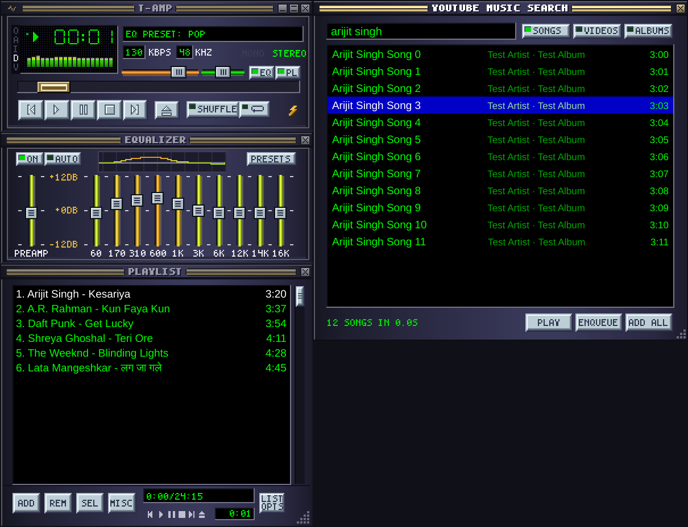

# T-Amp: a Winamp-classic player for YouTube Music

A native Windows player that looks and behaves like Winamp 2. It searches the
**YouTube Music** catalogue as you type and plays only what it finds there. You don't
need an API key, a login or a browser.



*A test-suite render, not a live session. The playlist titles and search results are
sample data (the search results are canned, hence "Test Artist"), and the kbps/kHz are
stubbed. The analyser, EQ curve and time display are running on audio that was really
decoded, from a local test file.*

## Run it

| Way | What you do | Good for |
|---|---|---|
| **Ready-made .exe** | [Releases](https://github.com/ashumedico/ashumedico/releases) → latest **T-Amp** → download **T-Amp-windows.zip** → unzip → `T-Amp\T-Amp.exe`. It isn't code-signed, so Windows may say *"Windows protected your PC"*: **More info → Run anyway** | No Python needed |
| **From this folder** | Double-click `RUN.bat` (first run sets up `.venv`, about 3 min, once) | You have Python 3.10+ |
| **Your own .exe** | `RUN.bat` once, then `BUILD-EXE.bat`: it builds `dist\T-Amp\T-Amp.exe` and puts **T-Amp** on the Desktop | Same as above, plus a shortcut |

Something not working? `SELFTEST.bat` checks every part with real data and says
which one failed or was blocked: ffmpeg, the JavaScript runtime, your sound device, a
live search, downloading a song, 3 seconds of decoded audio, and 3 seconds played aloud through
the player's own engine (you will hear the song). The report is saved to
`%APPDATA%\T-Amp\selftest.txt`. If a song won't play, the full reason is in
`%APPDATA%\T-Amp\playback.log` (the title display scrolls it too). If T-Amp ever closes
on its own, the reason is in `%APPDATA%\T-Amp\crash.log`.

## What's in it

- **Main window:** green LCD time (click it for remaining time; it blinks when paused),
  a scrolling song title (Hindi and other non-Latin titles switch to a real font),
  kbps / kHz / mono-stereo from the actual stream, volume and balance (with a centre
  detent), a seek bar, transport, shuffle and repeat, and the **O A I D V** clutterbar.
- **Visualiser:** a spectrum analyser with falling peaks, or an oscilloscope; click to
  cycle. It analyses the samples that are reaching your speakers *now*, not a guess.
- **Equalizer:** preamp plus 10 bands (60 Hz–16 kHz, ±12 dB), applied in real time, 18
  presets, and a graph of the filters' true response. **AUTO** remembers your EQ per song.
- **Playlist editor:** Winamp's green-on-black list with the current track in white and
  the selection in blue. Drag rows to reorder, use the ADD / REM / SEL / MISC / LIST OPTS
  menus, save and load `.m3u8`, and resize in 29-px steps.
- **YouTube Music search:** results follow your typing. **SONGS / VIDEOS / ALBUMS**
  (Tab switches); pick an album and its tracks are added in order. Paste a
  `music.youtube.com` link (song, album or playlist) to add it. Plain youtube.com
  links are refused, because they can point at any video.
- **Windowshade** (double-click the title bar), **double size** (Ctrl+D), always on top,
  snapping to screen edges, and the search window docking beside the player.
- **Media keys** (Play/Pause, Next, Previous, Stop) work even when T-Amp isn't focused.
  You can turn this off in Options.
- **Remembers everything:** playlist, volume, EQ, window positions, and sizes.
- **Only one T-Amp:** opening it again brings the running one forward.

## Keys (the original Winamp map)

| Key | Action | Key | Action |
|---|---|---|---|
| `Z` `X` `C` `V` `B` | Prev, Play, Pause, Stop, Next | `L` / `J` / `Ins` | Search YouTube Music |
| `←` `→` | Seek 5 s | `↑` `↓` | Volume |
| `S` / `R` | Shuffle / Repeat | `Ctrl+D` | 1x / 2x size |
| `Ctrl+W` | Windowshade | `Ctrl+A` | Always on top (in the playlist: select all, as in Winamp) |
| `Alt+G` / `Alt+E` | Equalizer / Playlist | `Alt+3` | Track info |
| `Del` | Remove selected rows | `Alt+↑` `Alt+↓` | Move selected rows |

In the search box: `↑` `↓` choose, `Enter` play, `Shift+Enter` enqueue,
`Ctrl+Enter` enqueue every result, `Tab` switches Songs / Videos / Albums, `Esc` clears and then closes.

## How it works

```
type -> ytmusicapi (YouTube Music search) -> pick -> yt-dlp + Deno downloads the audio
     -> local cache file (played while it is still arriving) -> ffmpeg (decode to PCM)
     -> buffer -> EQ (scipy biquads) -> visualiser tap -> volume / balance -> PortAudio
```

yt-dlp does all the talking to YouTube: finding the song *and* fetching its audio, with
its own headers, chunked requests, retries, cookies and your Windows proxy settings.
ffmpeg only ever reads a local file. Playback starts as soon as the first bytes land in
`%LOCALAPPDATA%\T-Amp\cache`; the rest arrives while it plays. Finished songs stay in
that cache, so playing one again is instant and seeking is always immediate. The
least recently played songs are removed past 1 GB (`"cache_mb"` in `state.json`).

In `tamp/engine.py`, decoding runs in a thread and playback runs in the sound card's
callback. YouTube lookups also run in background threads, and a click you've already
moved past is cancelled before it reaches YouTube. The sound device stays open between
songs, so changing tracks doesn't stall the window or leave a gap. If a download is cut
off, the song is fetched again and resumes where it stopped. The next song is downloaded
in the background halfway through the current one.

## Things to know

- **YouTube changes often, and old yt-dlp versions stop working.** T-Amp checks PyPI
  every 3 days and installs newer yt-dlp / ytmusicapi (SHA-256 verified) into
  `%APPDATA%\T-Amp\pylib`. Restart to use them. You can also check now from the menu:
  *Update YouTube engine*.
- **Some tracks need a signed-in account** (age-restricted, members-only, blocked in
  your region). T-Amp shows the reason in the title display and moves on to the next track.
- **"Sign in to confirm you're not a bot"**: YouTube sends this check to datacenter and VPN
  addresses (it's why the CI's stream check can't run on GitHub's servers). A home connection
  normally doesn't get it. If you do, use *Options → YouTube sign-in* and choose cookies from
  your browser (Firefox is the dependable one on Windows; Chrome and Edge lock their cookie
  store) or a `cookies.txt` export. T-Amp then stops rather than skipping through the whole
  playlist.
- Search results are for region **IN** (`"region"` in `%APPDATA%\T-Amp\state.json`).
- For personal listening. Streams come straight from YouTube, so YouTube's terms
  apply. Inspired by Winamp 2; not affiliated with Winamp or YouTube, and no Winamp
  skin bitmaps are used (the classic look is drawn in code).

## Development

```
pip install -r requirements.txt pytest
python -m pytest tests -q          # engine, EQ, visualiser, offscreen UI, parsing, updater
python -m tamp                     # run from source
python -m tamp --selftest          # the end-to-end check
```

CI (`.github/workflows/t-amp-windows.yml`) runs the tests on Windows and builds the
.exe. It then runs the built .exe's self-test against live YouTube Music. Pushing a
`t-amp-vX.Y.Z` tag also publishes that build as a GitHub Release.
